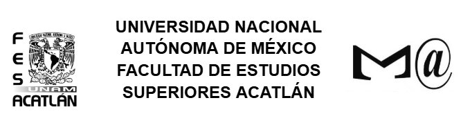

### Programs C
Aquí puedes ver algunos programas básicos hechos en C sobre tipos de datos,punteros, manipulación de archivos y gráficos.

### Para qué sirve
Este proyecto es de carácter totalmente formativo. Son algunos ejercicios realizados para la práctica constante de la lógica de programación, así como la práctica de sintáxis en C.
Dichos programas fueron actividades propuestas en clases de programación impartidas en la carrera de MAC (Matemáticas Aplicadas y Computación).

Elaborados por: Diana García Melgarejo.

